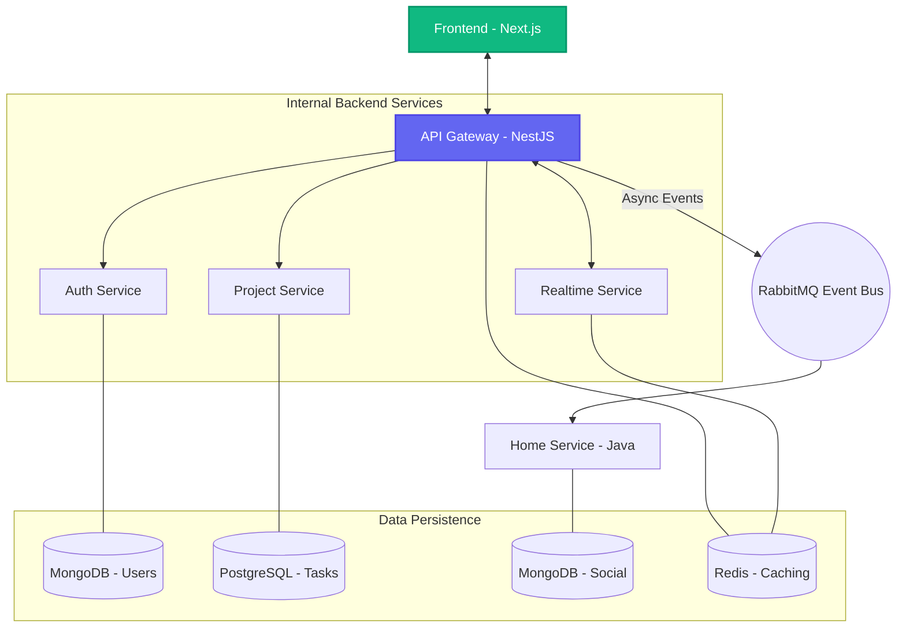

# 🏛️ Architecture Overview - SmartCollab

SmartCollab is a high-performance, AI-powered project management platform built on a **Microservices Monorepo** architecture. It leverages a multi-language backend (Node.js/NestJS + Java/Spring Boot) to balance development speed with high-throughput data processing.

---

## 🗺️ High-Level System Design

---

## 📦 Core Components

### 1. API Gateway (The Unified Entry Point)
- **Technology**: NestJS
- **Responsibility**: Central hub for all client requests. It handles:
  - Request routing to internal microservices.
  - Authentication proxy (verifying JWTs).
  - Data aggregation (Search, User profiles).
  - Global rate limiting and security headers (Helmet).
  - Integrated **Real-time Gateway** (Socket.io) for collaborative features.

### 2. Auth Service (Identity & Security)
- **Technology**: NestJS + Prisma (MongoDB)
- **Responsibility**: Manages user registration, login, and Google OAuth integration.
- **Data Layer**: Stores user profiles, credentials, and session metadata in MongoDB.

### 3. Project Service (The Logic Engine)
- **Technology**: NestJS + Prisma (PostgreSQL)
- **Responsibility**: Core business logic for project management:
  - CRUD for Boards, Columns, and Cards.
  - Role-based Access Control (RBAC) for project members.
  - Subtask management.
- **Data Layer**: Uses PostgreSQL for strict relational integrity of project structures.

### 4. Home Service (High-Throughput Java Worker)
- **Technology**: Spring Boot 3.3 + Spring Data MongoDB
- **Responsibility**: Handles social and background workloads:
  - Social Feed generation (Posts, Comments, Reactions).
  - Notification system (Email, In-app).
  - Async event consumption from RabbitMQ.
  - High-performance follower/following system.

### 5. Realtime Logic (Collaboration)
- **Technology**: NestJS WebSockets (Socket.io) + Redis Adapter
- **Responsibility**: Powers the "Live" experience:
  - Real-time card movement and updates.
  - Online presence tracking.
  - Distributed state management via Redis locks to prevent concurrent edit conflicts.

---

## 🔄 Communication Patterns

### Synchronous (HTTP/REST)
- Used primarily for Client → Gateway → Microservice interactions where immediate feedback is required (e.g., login, creating a project).

### Asynchronous (Event-Driven)
- Powered by **RabbitMQ**.
- Services emit events (e.g., `card.created`, `user.registered`).
- The **Home Service** and **Realtime Service** consume these events to trigger side effects like sending notifications or updating social feeds.

### Real-time (WebSockets)
- Bi-directional communication for collaborative editing.
- Uses **Redis Pub/Sub** adapter to support horizontal scaling across multiple gateway instances.

---

## 💎 Data Strategy: Decentralized Prisma

Unlike a single monolithic database, SmartCollab uses **Domain-Driven Design (DDD)** for its data:
- Each service owns its database and schema.
- **Prisma** is used in Node.js services but generates isolated clients into `node_modules/.prisma/[service]-client`.
- No cross-service database joins are allowed; services communicate via APIs or Events.

---

## 🤖 AI Integration Layer

SmartCollab integrates multiple AI providers to automate project workflows:
- **Providers**: Gemini 2.0 (Google), Groq (Llama 3), OpenAI.
- **Features**: 
  - Automated project structure generation.
  - Strategic roadmap suggestions.
  - Intelligent task breakdown and description generation.

---

## 🚢 Deployment & Infrastructure

- **Monorepo Management**: [pnpm Workspaces](https://pnpm.io/workspaces) + [Turborepo](https://turbo.build/).
- **Containerization**: Docker for all infrastructure and application services.
- **CI/CD**: GitHub Actions for automated testing and building.
- **Observability**: Centralized logging and health checks via the Gateway.
