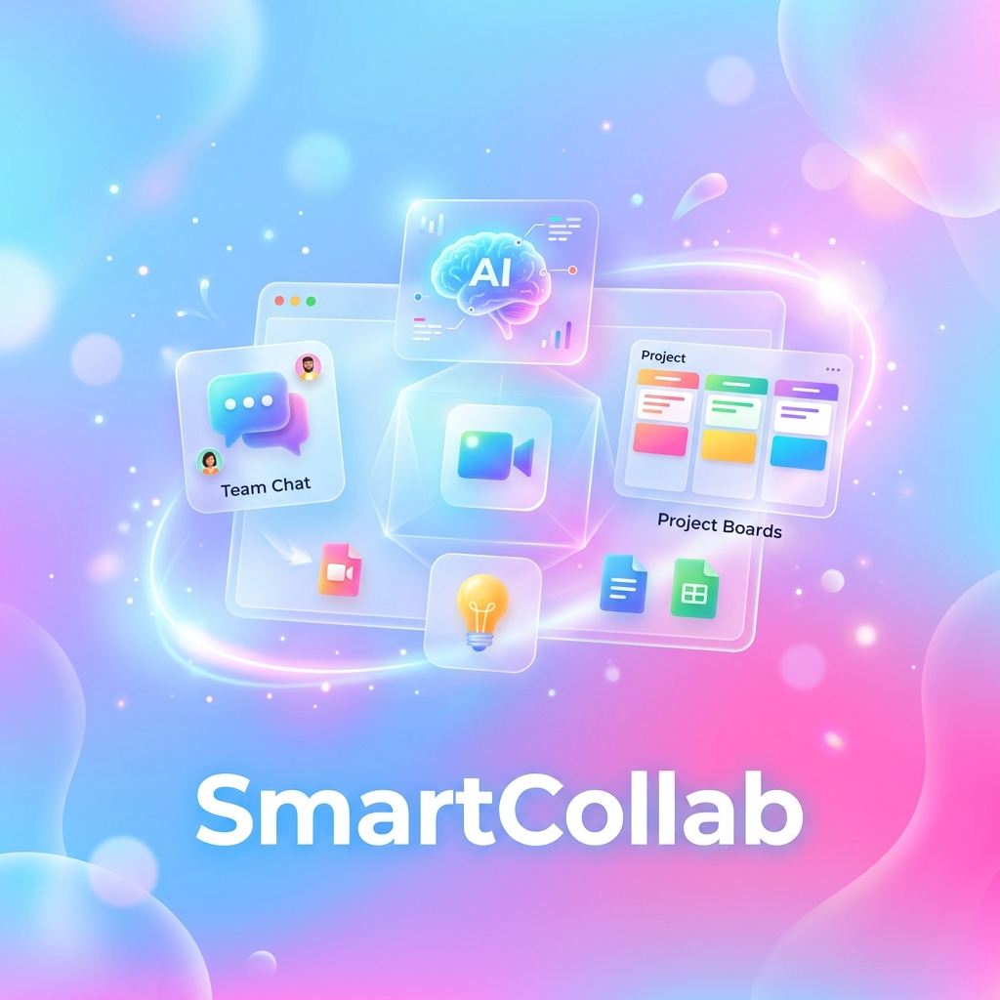
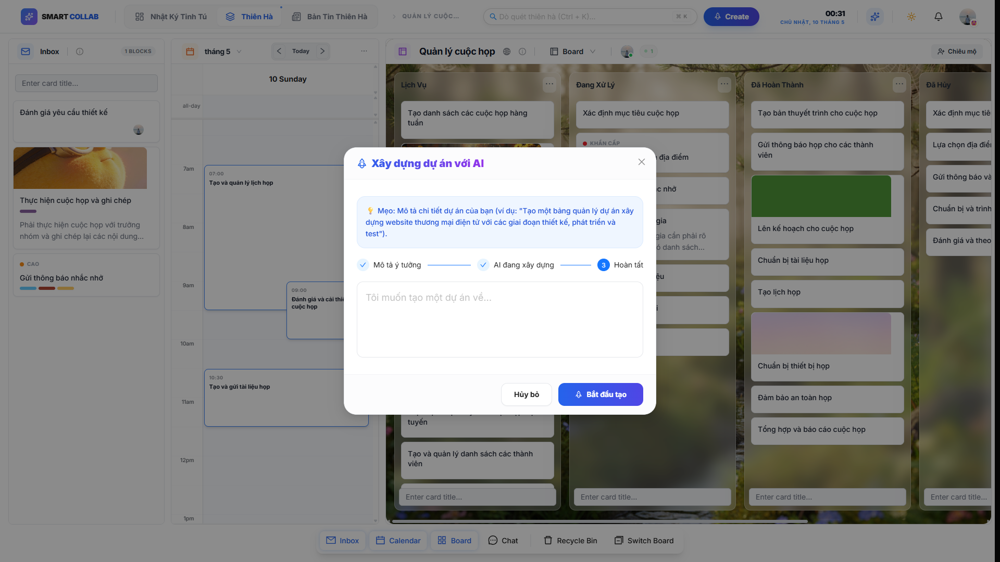
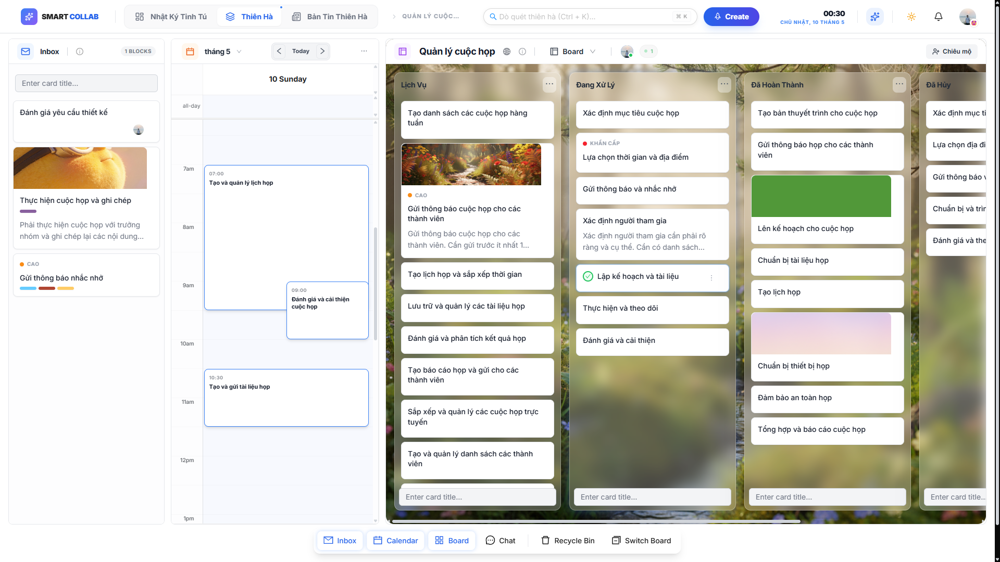
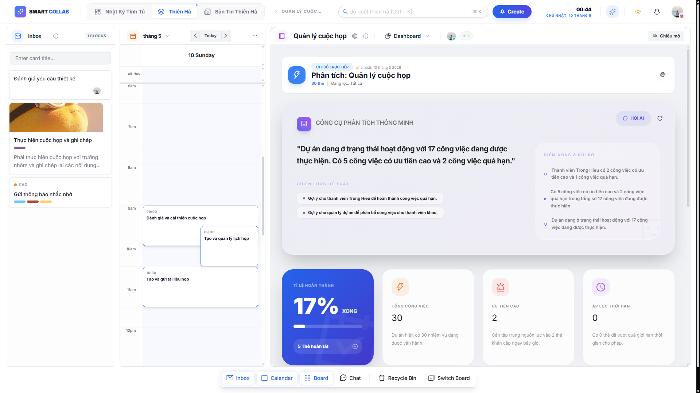
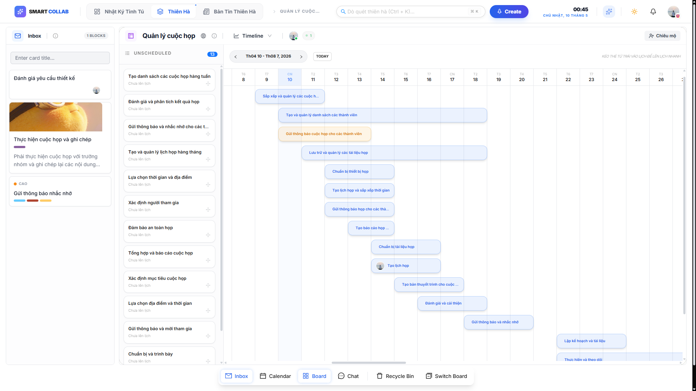
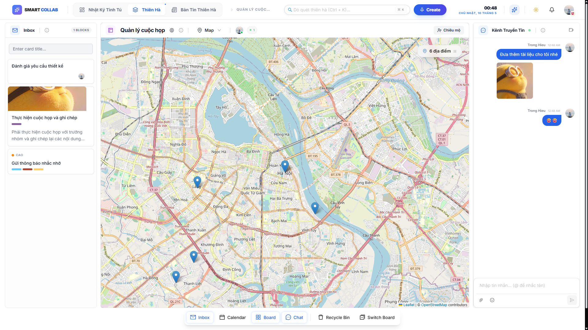
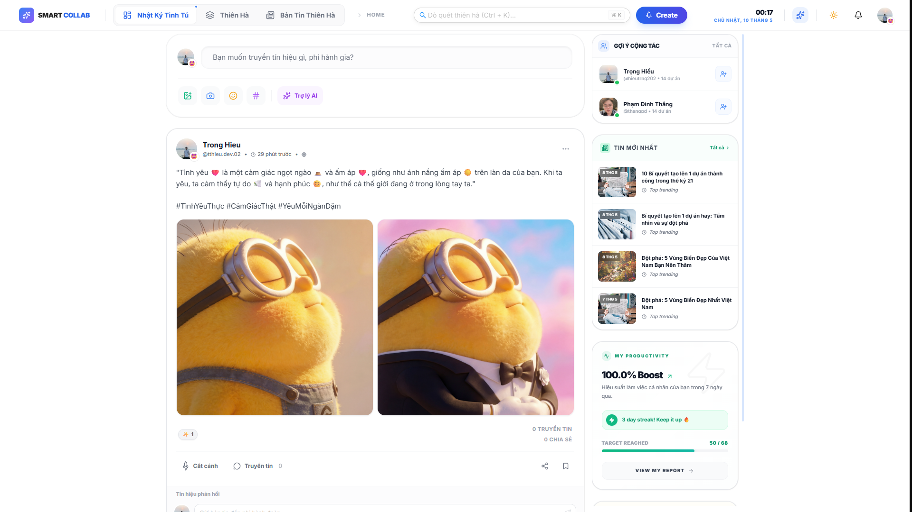
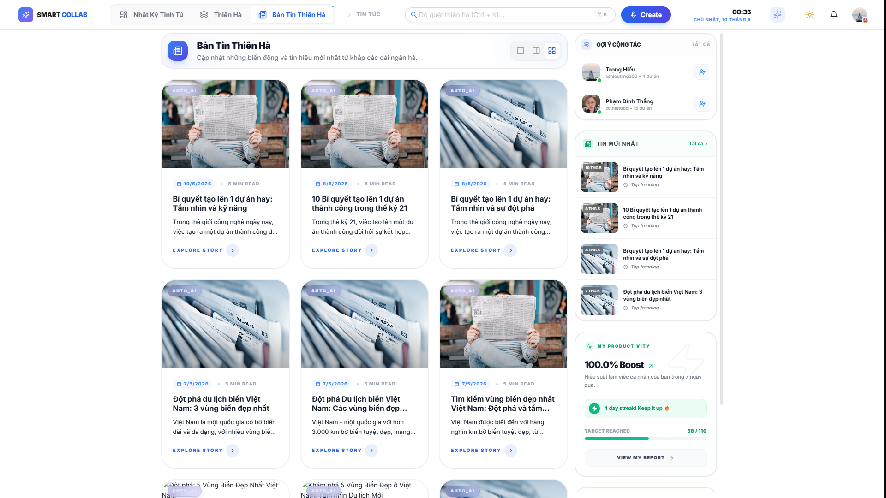
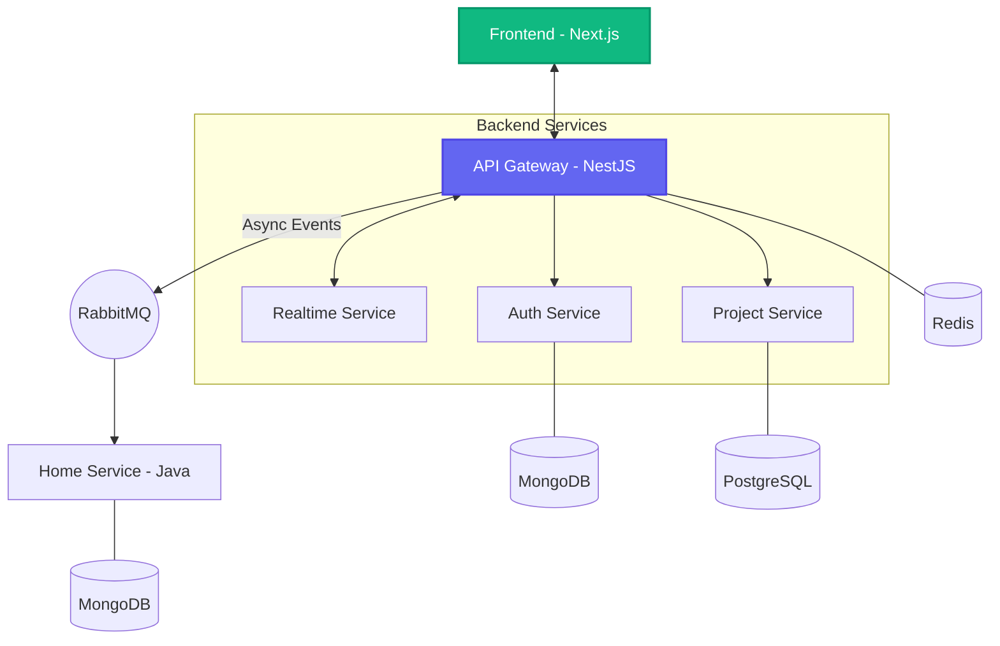

# SmartCollab - AI-Powered Microservices Monorepo

<div align="center">




**A high-performance microservices monorepo for collaborative project management with real-time updates, AI-driven automation, and multi-language backend (Node.js + Java).**

Repository: https://github.com/tthieu22/smart-collab

[Features](#-features) • [Visual Demos](#-visual-demos) • [Architecture](#-architecture) • [Service Overview](#-services-overview) • [Quick Start](#-quick-start)

</div>

## 🌟 Features

### Core Capabilities
- ✅ **Project Management** - Multi-board, column, and card system for agile teams
- ✅ **AI Integration** - Automated project structure generation via Gemini/Groq/OpenAI
- ✅ **Real-time Collaboration** - Integrated WebSocket gateway for live updates and notifications
- ✅ **Cross-Service Auth** - Secure JWT-based authentication with Google OAuth integration
- ✅ **Social Feed & Interaction** - Java-powered high-performance feed, reactions, and followers
- ✅ **Smart Notifications** - Multi-channel alerts (Email, Real-time) via Java workers
- ✅ **Advanced Search** - Comprehensive search across projects and users

---

## 📸 Visual Showcase

### 🤖 AI-Powered Project Intelligence
Generate entire project structures, detailed task descriptions, and strategic roadmaps in seconds. SmartCollab integrates with Gemini 2.0, Groq, and OpenAI to turn simple prompts into actionable project plans.


### 📊 Multi-Dimensional Collaborative Workspace
SmartCollab offers four distinct view modes to manage your projects from every angle. Switch seamlessly between views to gain unique insights and optimize your workflow.

| View Mode | Description |
| :--- | :--- |
| **Kanban Board** | Classic drag-and-drop interface for agile task management and real-time collaboration. |
| **Smart Dashboard** | AI-powered analytics, productivity metrics, and project health monitoring at a glance. |
| **Timeline (Gantt)** | Visualize project milestones, task durations, and dependencies over time. |
| **Geographic Map** | Track project locations and geographically-linked tasks on an interactive map. |

#### 📋 Kanban Board View


#### 📈 AI Dashboard View


#### ⏳ Timeline View


#### 📍 Interactive Map View


### 🚀 High-Performance Social Feed (Java-Powered)
Connect with your team beyond just tasks. Our Java-based social engine handles high-throughput feeds, reactions, and follower systems with extreme efficiency.


### 📰 AI-Powered News & Intelligence
Stay ahead with automated industry news and project intelligence. Our system generates relevant content and updates using advanced AI models to keep your team informed.


### Technical Highlights
- ✅ **Monorepo with pnpm Workspaces** - Efficient dependency management and shared libraries
- ✅ **Decentralized Prisma** - Domain-driven design with per-service Prisma schemas
- ✅ **Multi-Language Backend** - Combining NestJS (Node.js) and Spring Boot (Java)
- ✅ **Event-Driven** - Seamless service communication via RabbitMQ
- ✅ **Hybrid Storage** - PostgreSQL for relational data and MongoDB for document-based social data
- ✅ **Type-Safe** - Shared TypeScript types across frontend and Node.js services

## 🎬 Visual Demos

### Dashboard Overview


### Video Walkthrough
> [!TIP]
> Click the image below to watch the full project walkthrough and AI integration demo.

[](https://www.youtube.com/watch?v=placeholder)

## 🏗️ Architecture

### Monorepo Benefits
- **Single node_modules** - Saves disk space, faster installs
- **Dependency hoisting** - Shared dependencies (Prisma, NestJS)
- **Workspace packages** - Import local libraries with `@smart-collab/*`
- **Unified builds** - Turborepo for efficient builds

### High-Level Flow


### Services Communication
- **Client Entry**: All frontend requests go through the **API Gateway (Port 8000)**.
- **Service Mesh**: Internal communication between services happens via **RabbitMQ** (async) or direct RPC.
- **Real-time**: Handled via Socket.io integrated into the Gateway/Realtime service.

### Database Schema
- **PostgreSQL** - Project, boards, cards, columns (relational data)
- **MongoDB** - Users, posts, comments, notifications (document data)
- **Redis** - Caching, sessions, rate limiting, and Socket.io adapter
- **RabbitMQ** - Async service-to-service communication event bus

## 📋 Services Overview

| Service | Technology | Port | Database | Purpose |
|---------|------------|------|----------|---------|
| **Frontend** | Next.js | Worker | - | Modern Web Interface |
| **API Gateway** | NestJS | **8000** | Redis | **Main Entry Point**, Auth Proxy, Aggregation |
| **Realtime** | NestJS | Worker | Redis | WebSockets, Live Updates, Collaboration |
| **Auth Service** | NestJS | Worker | MongoDB | Identity management & JWT (Internal) |
| **Project Service** | NestJS | Worker | PostgreSQL | Project & Task engine (Internal) |
| **Home Service** | Spring Boot | Worker | MongoDB | Social Feed, Reactions & Java Workers |

## 💎 Prisma Architecture

Unlike traditional monorepos, SmartCollab uses a **Decentralized Prisma** pattern. Each service maintains its own `prisma` directory and generated client to ensure strict service boundaries.

- **Auth Service**: `apps/auth/prisma/schema.prisma` (MongoDB provider)
- **Project Service**: `apps/project/prisma/schema.prisma` (PostgreSQL provider)

> [!IMPORTANT]
> There is **no root Prisma schema**. Each service generates its own client into `node_modules/.prisma/[service]-client`.

## ☕ Java Microservices (Spring Boot)

The Java ecosystem handles high-throughput social and notification workloads.

1. **Home Service**: A multi-purpose Java worker that manages the social feed, user interactions (reactions, followers), AI-generated content, and multi-channel notifications (consuming events from RabbitMQ).

### Setup Java Environment:
- JDK 21+
- Maven 3.9+
- Environment variables configured in `java-service/home-service/.env`

## 🚀 Quick Start

### 1. Prerequisites
```bash
# Node & PNPM
npm install -g pnpm

# Java (for Java services)
# Ensure JAVA_HOME points to JDK 21

# Infrastructure (PostgreSQL, MongoDB, RabbitMQ, Redis)
docker-compose up -d
```

### 2. Install & Generate
```bash
# Install all dependencies
pnpm install

# Generate Prisma clients for individual services
pnpm --filter auth prisma generate
pnpm --filter project prisma generate
```

### 3. Running Services
```bash
# Start Node.js services (Gateway, Auth, Project, Frontend)
pnpm dev:all

# Start Java services
cd java-service/home-service
./mvnw spring-boot:run
```

## 📁 Project Structure

```
smart-collab/
├── 📱 apps/
│   ├── api-gateway/       # Port 8000 (Central Hub + WebSockets)
│   ├── auth/              # Port 3001 (User management)
│   ├── project/           # Port 3002 (Task management)
│   └── frontend/          # Port 3000 (Next.js UI)
│
├── ☕ java-service/       # Spring Boot Services
│   └── home-service/      # Social Feed, News & Notifications
│
├── 📚 libs/               # Shared logic
│   └── shared/            # Common types & utilities
│
└── docker-compose.yml     # Local infra (DBs, MQ, Redis)
```

## 🔧 Commands Reference

### Development
```bash
# Start all services in parallel
pnpm dev:all

# Start specific service
pnpm --filter auth run dev

# Watch and rebuild shared libraries
pnpm --filter @smart-collab/shared run dev
```

### Database
```bash
# Generate Prisma clients (all services)
pnpm prisma:generate

# Push schema to database
pnpm --filter [service] prisma db push

# Open Prisma Studio (database GUI)
pnpm --filter [service] prisma studio
```

### Building & Testing
```bash
# Build all services
pnpm build:all

# Run all tests
pnpm -r run test

# Run linting
pnpm -r run lint

# Java Build
cd java-service/home-service
mvn clean package -DskipTests
```

## 📚 Documentation

- **[SETUP_GUIDE.md](./SETUP_GUIDE.md)** - Complete setup instructions
- **[ARCHITECTURE.md](./ARCHITECTURE.md)** - System design and components
- **[Auth Schema](./apps/auth/prisma/schema.prisma)** - User data models
- **[Project Schema](./apps/project/prisma/schema.prisma)** - Task management models

## 🔐 Environment Configuration

Each service has its own `.env` file for configuration:
```bash
# Node.js
apps/auth/.env
apps/project/.env
apps/api-gateway/.env
apps/frontend/.env

# Java
java-service/home-service/.env
```

**Important:** Ensure `JWT_SECRET`, `DATABASE_URL`, `RABBITMQ_URL`, and `REDIS_URL` are correctly set across all `.env` files.

## 📦 Dependencies

### Node.js Workspace Packages
- `@smart-collab/shared`: Common utilities and types
- `@smart-collab/events`: Shared event definitions for RabbitMQ
- `@smart-collab/mailer`: Shared email service logic

### External Services
- **Cloudinary**: Asset management and CDN
- **Gmail SMTP**: Email delivery
- **Google OAuth**: Social authentication
- **AI Providers**: OpenAI, Groq, and Gemini

## 🐛 Troubleshooting

### Issue: "Cannot find module '@prisma/client'"
**Solution**: Regenerate Prisma clients for the specific service or all services using `pnpm prisma:generate`.

### Issue: Port already in use
**Solution**: Kill the process or change the `PORT` in the respective `.env` file.
- Windows: `netstat -ano | findstr :3000`
- macOS/Linux: `lsof -i :3000`

### Issue: Database connection failed
**Solution**: Check `DATABASE_URL` in `.env` and ensure infrastructure is running: `docker-compose up -d`.

## 🚢 Deployment

### Docker Deployment
```bash
# Build Docker images
docker build -t smart-collab-frontend apps/frontend
docker build -t smart-collab-api-gateway apps/api-gateway

# Run with Docker Compose
docker-compose -f docker-compose.prod.yml up
```

### Production Checklist
- [ ] Update `.env` files with production credentials.
- [ ] Set up managed PostgreSQL and MongoDB instances.
- [ ] Configure RabbitMQ and Redis clusters.
- [ ] Enable HTTPS and secure headers.
- [ ] Set up monitoring and logging (ELK, Prometheus).

## 🤝 Contributing

1. Fork the repository.
2. Create a feature branch (`git checkout -b feature/AmazingFeature`).
3. Commit changes (`git commit -m 'Add AmazingFeature'`).
4. Push to branch (`git push origin feature/AmazingFeature`).
5. Open a Pull Request.

## 📄 License
This project is licensed under the MIT License - see the [LICENSE](LICENSE) file for details.

## 👥 Authors
- **Hiếu** - Backend & Architecture Developer
- GitHub: [tthieu22](https://github.com/tthieu22)

## 🙏 Acknowledgments
- Built with [NestJS](https://nestjs.com/) and [Spring Boot](https://spring.io/)
- Database management with [Prisma](https://www.prisma.io/)
- Workspaces managed with [pnpm](https://pnpm.io/)

## 📞 Support
For support, email **tthieu.dev.02@gmail.com** or open an issue in the GitHub repository.

---

<div align="center">
Made with ❤️ by <b>Hiếu</b> | <a href="https://github.com/tthieu22/smart-collab">GitHub Repository</a>
</div>
