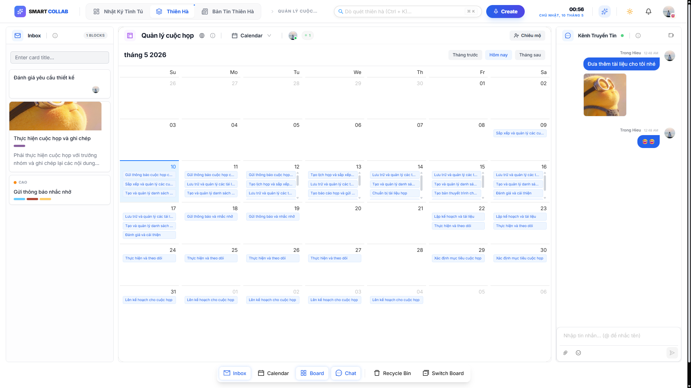
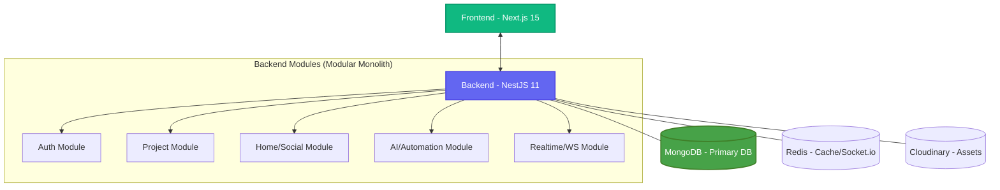

# SmartCollab - AI-Powered Modular Monolith

<div align="center">


**A high-performance modular monolith for collaborative project management with real-time updates, AI-driven automation, and a unified MongoDB ecosystem.**

Repository: https://github.com/tthieu22/smart-collab
**Live Demo**: [https://tthieu-smart-collab.vercel.app/](https://tthieu-smart-collab.vercel.app/)

[Features](#-features) • [Visual Showcase](#-visual-showcase) • [Architecture](#-architecture) • [Quick Start](#-quick-start) • [Tech Stack](#-tech-stack)

</div>

## 🌟 Features

### 🚀 Core Capabilities
- ✅ **Project Management** - Multi-board, column, and card system for agile teams.
- ✅ **6 Distinct Views** - Kanban, Dashboard, Timeline, Calendar, Table, and Map views.
- ✅ **AI-Powered Intelligence** - Generate project structures, task descriptions, and roadmaps via Gemini 2.0 / Groq / OpenAI.
- ✅ **Real-time Collaboration** - Instant updates and live presence via Socket.io.
- ✅ **Social Ecosystem** - High-performance news feed, reactions, followers, and user profiles.
- ✅ **AI News & Articles** - Automated industry news generation and project intelligence.
- ✅ **Cloud-Ready Uploads** - Integrated Cloudinary support for media and attachments.
- ✅ **Advanced Search** - Global search across projects, cards, and users.

---

## 📸 Visual Showcase

### 🤖 AI-Powered Project Intelligence
Generate entire project structures and strategic roadmaps in seconds. SmartCollab integrates with Gemini 2.0, Groq, and OpenAI to turn simple prompts into actionable project plans.


### 📊 Multi-Dimensional Collaborative Workspace
Manage your projects from every angle with six specialized view modes.
| View Mode | Description |
| :--- | :--- |
| **Kanban Board** | Classic drag-and-drop interface for agile task management. |
| **Smart Dashboard** | AI-powered analytics and productivity metrics at a glance. |
| **Timeline (Gantt)** | Visualize project milestones and task durations over time. |
| **Calendar View** | Track deadlines and project tempo on a monthly layout. |
| **Table View** | Structured list view for comprehensive data management. |
| **Geographic Map** | Track project locations and geographically-linked tasks. |

#### 📋 Workspace Screenshots
<div align="center">
  <table>
    <tr>
      <td><b>Kanban Board</b><br/></td>
      <td><b>AI Dashboard</b><br/></td>
    </tr>
    <tr>
      <td><b>Timeline View</b><br/></td>
      <td><b>Calendar View</b><br/></td>
    </tr>
  </table>
</div>

---

## 🏗️ Architecture

### Modular Monolith
SmartCollab has evolved from a microservices architecture into a **Modular Monolith**. This design provides the perfect balance between service separation and development simplicity, ensuring high performance while reducing infrastructure complexity.

### High-Level Flow


---

## 🛠️ Tech Stack

### Frontend
- **Framework**: Next.js 15 (App Router)
- **Styling**: TailwindCSS, Framer Motion
- **Icons**: Lucide React
- **State Management**: TanStack Query (React Query)

### Backend
- **Framework**: NestJS 11
- **Database ORM**: Prisma (MongoDB Connector)
- **Real-time**: Socket.io
- **Security**: Passport.js (JWT, Google OAuth 2.0)
- **Validation**: Zod / Class-validator

### AI & Infrastructure
- **AI Models**: Google Gemini 2.0, Groq (Llama 3), OpenAI GPT-4o
- **Cloud Storage**: Cloudinary
- **Database**: MongoDB Atlas
- **Caching**: Redis (Upstash/Local)

---

## 🚀 Quick Start

### 1. Prerequisites
- **Node.js** >= 18.x
- **pnpm** >= 9.x
- **MongoDB** (Local or Atlas)
- **Redis** (Optional, for production scaling)

### 2. Installation
```bash
# Clone the repository
git clone https://github.com/tthieu22/smart-collab.git
cd smart-collab

# Install dependencies
pnpm install
```

### 3. Environment Setup
Create `.env` files in `apps/api-gateway` and `apps/frontend` using the provided samples.
```bash
# apps/api-gateway/.env
DATABASE_URL="mongodb+srv://..."
JWT_SECRET="..."
GOOGLE_CLIENT_ID="..."
GROQ_API_KEY="..."
CLOUDINARY_URL="..."
```

### 4. Database Sync
```bash
# Generate Prisma client
pnpm --filter api-gateway prisma generate

# Push schema to MongoDB
pnpm --filter api-gateway prisma db push
```

### 5. Running the Application
```bash
# Start all services (Frontend & Backend)
pnpm dev:all
```
- **Frontend**: [http://localhost:3000](http://localhost:3000)
- **Backend API**: [http://localhost:8000](http://localhost:8000)

---

## 📁 Project Structure

```
smart-collab/
├── 📱 apps/
│   ├── api-gateway/       # Unified NestJS Backend (Port 8000)
│   │   ├── src/auth/      # Identity & Security
│   │   ├── src/project/   # Workspace & Task Management
│   │   ├── src/home/      # Social Feed & News
│   │   ├── src/ai/        # AI Automation Logic
│   │   └── src/realtime/  # WebSockets & Collaboration
│   └── frontend/          # Next.js 15 UI (Port 3000)
├── 📚 assets/             # Project screenshots & branding
└── docker-compose.yml     # Local infra (Redis, MongoDB)
```

---

## 🤝 Contributing
1. Fork the repository.
2. Create a feature branch (`git checkout -b feature/AmazingFeature`).
3. Commit changes (`git commit -m 'Add AmazingFeature'`).
4. Push to branch (`git push origin feature/AmazingFeature`).
5. Open a Pull Request.

## 📄 License
This project is licensed under the MIT License - see the [LICENSE](LICENSE) file for details.

## 👥 Authors
- **Hiếu** - Fullstack & Architecture Developer
- GitHub: [@tthieu22](https://github.com/tthieu22)
- Email: **tthieu.dev.02@gmail.com**

---

<div align="center">
Made with ❤️ by <b>Hiếu</b> | <a href="https://github.com/tthieu22/smart-collab">GitHub Repository</a>
</div>

